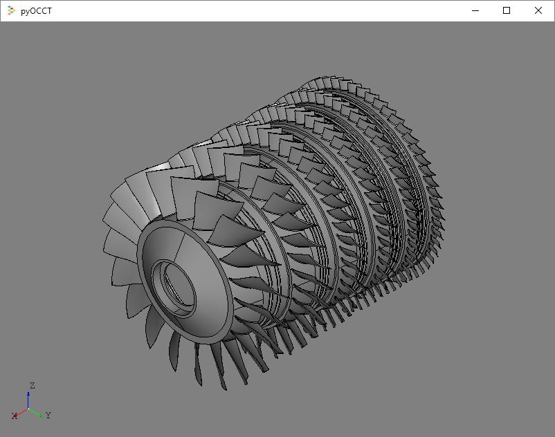

# pyOCCT — Python bindings for OpenCASCADE

The **pyOCCT** project provides Python bindings to the OpenCASCADE 7.2.0
geometry kernel and SMESH 8.3.0 meshing library via pybind11. Together, this
technology stack enables rapid CAD/CAE application development in the popular
Python programming language.

Are you a pybind11 expert? If so, check out the
[Design Considerations](http://pyocct.readthedocs.io/en/latest/dev.html#design-considerations)
documentation and share your thoughts and ideas!

## Technology Stack
The pyOCCT core technology stack includes:

* [pybind11](https://github.com/pybind/pybind11): This is a lightweight
  header-only library that exposes C++ types to Python and proved to be a
  natural fit for the large and complex OpenCASCADE codebase.

* [OpenCASCADE](https://www.opencascade.com): This mature library provides
  advanced geometric modeling and CAD functionality and is under active
  development. Newer versions (i.e., beyond 7.0.0) provide robust and
  high-performance Boolean operations.

* [Netgen](https://sourceforge.net/projects/netgen-mesher): This library
  enables advanced meshing capabilities including 3-D tetrahedral and 2-D
  unstructured quad-dominated surface meshing.

* [Salome Platform](http://www.salome-platform.org): The core meshing library
  from this open source application serves as the central component for
  pyOCCT's mesh generation capabilities.

## Resources
More resources for using, developing, and navigating the pyOCCT project will be
made available, but for now the OpenCASCADE C++ documentation provides the most
complete set of information. The pyOCCT interface should be very similar to its
C++ counterpart. More resources will be available soon.

* [OpenCASCADE Technology Overview](https://www.opencascade.com/doc/occt-7.2.0/overview/html/index.html)
* [OpenCASCADE Reference Manual](https://www.opencascade.com/doc/occt-7.2.0/refman/html/index.html)
* [OpenCASCADE forums](https://www.opencascade.com/forums)
* [OpenCASCADE issue tracker](https://tracker.dev.opencascade.org/)
* [Chat on Gitter](https://gitter.im/pyOCCT/Lobby)
* [Submit issues](https://github.com/LaughlinResearch/pyOCCT/issues)

## Requirements
The following tools and libraries should be available to build, install, or
use pyOCCT. The links are meant to provide useful references or recommendations
but are not necessarily the only place to find them.

### Core
Core components for pyOCCT:

* **C++11 compiler (Required)**: Visual Studio 14 has been used so far.

* **Python 2.X or 3.X (Required)**: So far 3.5 has been tested but support for
  2.7 and 3.X is anticipated.

* **pybind11 (Required)**: Version 2.3dev0 has been used but latest needs
  verified. Get it [here](https://github.com/pybind/pybind11).

* **OpenCASCADE 7.2.0 (Required)**: Available from [OPEN CASCADE SAS](https://www.opencascade.com/content/latest-release)
  or [conda-forge](https://anaconda.org/conda-forge/occt).
  
* **wxPython (Required)**: To support minimal visualization in Python.

* **SMESH 8.3.0 (Optional)**: Standalone version [here](https://github.com/LaughlinResearch/SMESH).

* **Netgen 6.2 (Optional)**: Special SMESH version [here](https://github.com/LaughlinResearch/netgen4smesh).

### Supporting
Supporting components are listed below along with what core component they
support:

* **Freetype 2.8.1 (OpenCASCADE)**

* **tbb 2018_20171205 (OpenCASCADE)**

* **VTK 8.1.0 (SMESH)**

* **pthreads (SMESH)**

# Getting Started
Detailed build instructions and CI services will be available soon so check
back for more information. Until then, a
[prebuilt Python wheel](http://bit.ly/2IcMtR5) is available for Windows 64-bit
Python 3.5 to give users a quick start. This contains the Python bindings as
well as all required dependencies including OCCT and VTK. This wheel can be
installed using [pip](https://pypi.python.org/pypi/pip/):

    pip install OCCT-0.0.1-cp35-none-win_amd64.whl

Anaconda Python is recommended for package management and since
many packages are available for some of the prerequisites. It is recommended
that a designated environment be created and used for pyOCCT. An example of
creating this environment for Anaconda Python within an Anaconda command prompt
is:

    conda create -n occt python=3.5

This will create an environment named "occt" with Python 3.5. Make sure this
environment is active when using pyOCCT. For Anaconda Python, activating this
environment may look like:

    activate occt
    
To support minimal visualization the wxPython package is required and can be
installed via conda by:

    conda install -c conda-forge wxpython
    
At this point the ``OCCT`` package should be available:

    from OCCT.TopoDS import TopoDS_Shape

Navigate to the *examples/* folder and run:

    python import_step.py
    
and you should see the following image in the viewing tool if all the
requirements are correctly installed.

Installation files can be cleaned up by:

    conda clean -a

# Help Wanted
For now, contributions to the source code will be incorporated manually. There
is a (mostly) automated tool for generating the source but it is not yet
available. As new versions of OpenCASCADE are released, it may be better to
patch up the existing bindings rather than rerun the binding generation tool.
The automated process still requires a handful of manual patches to capture
edge cases. Although, if the header files of new OpenCASCADE releases are
significantly different or there is an architectural change in pyOCCT, it makes
sense to use the automated tool.

In addition to the items in the
[Design Considerations](http://pyocct.readthedocs.io/en/latest/dev.html#design-considerations)
section in the documentation, some areas that could use contributor support:

* Cross-platform support
* Leverage CI tools like AppVeyor and Travis-CI
* Conda packages
* Tests, examples, and benchmarks
* Better exception handling
